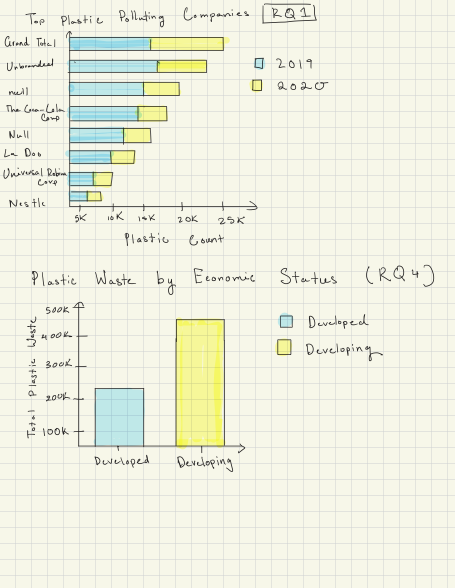

### Introduction

My dataset is the [Break Free From Plastic (BFFP)](https://github.com/rfordatascience/tidytuesday/blob/main/data/2021/2021-01-26/readme.mdz) from TidyTuesdays. This dataset looks at plastic waste collected during cleanup events around the world, where volunteers record variables like the country, year, parent company responsible, and counts of different plastic types.

The data comes from Break Free From Plastic global brand audits, which are organized to better understand where plastic pollution is coming from and to hold companies accountable. The dataset I'm using was put together by Sarah Sauve, who combined data from the 2019 and 2020 audits into one dataset. You find it [here](https://github.com/sarahsauve/TidyTuesdays/blob/master/BFFPDashboard/BlogPost.md).

She also created a blog post and Shiny app describing her data cleaning process and analysis. She made it to contribute to global audit and as a way to understand plastic waste in St. John.

Each row represents a summary of plastic collected for a specific company, in a specific country and year. The values in each row are counts of different types of plastic for each company.

The different types of plastic are numeric, and they can be anywhere from 0 to a few hundred depending on how common the material is.

Here are a few rows of the dataset:

```{r}
plastic <- read.csv("~/Documents/R/plastics.csv")
head(plastic)
plastic |> dplyr::sample_n(6)

```

## Data Cleaning

Sarah used several cleaning steps to make it usable. The original data came from a bunch of different CSV files from different countries and years, everything had to be combined into one dataset first. For the 2019 data, the country wasn’t included, so it was pulled from the file names and added as a new column. Also, not every country reported all plastic types, so missing columns like HDPE, PET, and more were added and filled with 0s. Some rows like “Grand Total” and entries where the company was listed as “NULL” were removed because they were just summary rows and not actual observations, which could mess up the analysis. The column names were also cleaned up so both years matched, and a year column was added before merging everything together.

## Explorations

### RQ1

Which parent companies contribute the most to plastic waste across different years?

### RQ2

How does the distribution of plastic types like HDPE, PET, and more differ by country?

### RQ3

How is plastic waste related to a a country’s recycling rate or waste management policies?

### RQ4

Is there a relationship between plastic waste and a countries economic status (devloped vs devloping countries)?

## Visualizations



How does the proportion of different plastic types differ across countries and change over time?


```{r}
library(dplyr)
library(purrr)
library(tidyr)
plastic_type <- c("hdpe", "ldpe", "o", "pet", "pp", "ps", "pvc")
results <- map_dfr(plastic_type, function(p){
  plastic %>% group_by(country, year) %>%
    summarize(
      total_plastic_per_year_country = sum(grand_total, na.rm = TRUE),
      type_count = sum(.data[[p]], na.rm = TRUE),
      .groups = "drop") %>%
    mutate(
      plastic_type = p, 
      proportion = type_count / total_plastic_per_year_country)})
results
results <- results %>% 
  select(country, year, total_plastic_per_year_country, plastic_type, proportion) %>%
  pivot_wider(
    names_from = plastic_type,
    values_from = proportion
  )
results %>%
  mutate(across(-c(country, year, total_plastic_per_year_country), ~ round(.x, 3)))
results
```
Notes: I grouped the data by country and year, summed total plastic and summed the total of plastic type, and then calculated proportions. I used map() to iterate through each plastic type and combined the results, then reshaped the data to compare types side by side.

Through this data I can see that in each country and year a few specific plastic types make up most of the total plastic waste, rather than contributing equally. For example, in Armenia the plastic type pet made up all of the country's plastic waste


How do two brands compare in terms of their global reach, and how similar are their distributions of plastic waste across countries?

```{r}

compare_brands <- function(brand1, brand2) {
  b1 <- plastic %>%
    filter(parent_company == brand1) %>%
    group_by(country) %>%
    summarize(count1 = sum(grand_total, na.rm = TRUE), .groups = "drop")
  
  b2 <- plastic %>%
    filter(parent_company == brand2) %>%
    group_by(country) %>%
    summarize(count2 = sum(grand_total, na.rm = TRUE), .groups = "drop")
  
  combined <- full_join(b1, b2, by = "country") %>%
    mutate(
      count1 = replace_na(count1, 0),
      count2 = replace_na(count2, 0))
  
  tibble(
    brand1 = brand1,
    brand2 = brand2,
    countries_brand1 = n_distinct(b1$country),
    countries_brand2 = n_distinct(b2$country),
    correlation = cor(combined$count1, combined$count2)
  )
}

compare_brands("The Coca-Cola Company", "PepsiCo")
```
Notes: The function takes in two brands as inputs and filters the dataset separately for each one. It then groups the data by country and calculates the total plastic associated with each brand in each country. The two datasets are combined so that both brands’ values are aligned by country, and missing values are replaced with 0 to show that they werent there. The function calculates the number of countries each brand appears in and computes a correlation coefficient to measure how similarly the two brands are distributed across countries. The Coca-Cola Company and PepsiCo had a correlation coef of .3598 showing that there is a weak correlation in how they’re plastic waste is distributed across countires.
